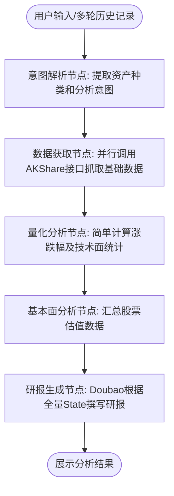

# Invest Agent - 个人投研分析助手

一个基于 **LangGraph** 和 **豆包 (Doubao) 大模型** 构建的专注于A股与国内期货的投行级个人投研 Agent。该 Agent 能够通过自然语言多轮对话，自动理解用户投资查询意图，获取实时行情和基本面数据，并最终撰写结构化的投研分析报告。

## 🌟 核心特性

- **自然语言意图提取**: 使用大模型精准识别用户想查询的股票/期货品种及其关注的具体维度（如技术面、基本面、消息面）。
- **多轮对话支持**: 基于 LangGraph 的 `MemorySaver` 实现了状态记忆，Agent 能记住你刚刚提过的股票并进行深入追问与多轮互动。
- **自动获取市场数据**: 集成了强大的 [AKShare](https://akshare.xyz/) 开源财经数据接口，支持拉取最新股票日线行情（前复权）、期货行情、及个股估值指标（PE、PB、总市值等）。
- **工作流式编排**: 使用 LangGraph 构建了清晰的有向无环图（DAG），剥离了“数据获取”、“量化分析”、“基本面分析”和“研报撰写”等专业环节，方便后续插拔和逻辑扩展。
- **研报级排版输出**: 分析结果由擅长逻辑排版的豆包 LLM 再次进行整合与提炼，直接输出图文并茂、结构严谨的 Markdown 格式报表。

## 🏗 架构设计图表 (Graph Flow)

系统按照以下节点流转执行：


## 🛠️ 安装与运行

### 1. 环境准备
项目基于 Python 3 编写，推荐在虚拟环境中运行：
```bash
# 1. 克隆或进入项目目录
cd invest-agent

# 2. 创建并激活虚拟环境 (可选)
python -m venv venv
source venv/bin/activate

# 3. 安装依赖包
pip install -r requirements.txt
```

### 2. 配置大模型 API
本项目深度兼容 OpenAI API 格式接入模型，默认配置为火山引擎（豆包）。
```bash
# 从模板复制环境变量配置文件
cp .env.example .env
```
打开 `.env` 文件并填入您的真实信息：
```env
OPENAI_API_BASE=https://ark.cn-beijing.volces.com/api/v3
OPENAI_API_KEY=your_doubao_api_key_here
LLM_MODEL_NAME=ep-xxxxxxxx-xxxxx  # 您的豆包接入点 Endpoint ID
```

### 3. 启动对话终端
执行主程序文件进入多轮连续对话模式：
```bash
python run.py
```
**提问示例**：
- *"帮我分析一下宁德时代(300750)近期的技术面以及基本面情况"*
- *"再看看茅台的估值水平"* (多轮记忆)
- *"帮我拉取螺纹钢主力的最新走势并做研判"*

## 📂 项目结构
```text
invest-agent/
├── run.py                    # 项目入口文件，启动终端对话循环
├── requirements.txt          # 项目运行依赖
├── .env.example              # 环境变量配置模板
└── src/
    └── agent/
        ├── state.py          # 图状态 (StateSchema) 定义
        ├── graph.py          # 图流转结构与边定义
        ├── node_intent.py    # \
        ├── node_fetch_data.py#  |-- 具体的各个业务节点逻辑
        ├── node_analysis.py  #  |
        ├── node_report.py    # /
        └── tools/
            └── akshare_tools.py # AKShare 接口包装工具
```

---
*声明：本工具生成的分析内容仅为数据整合与大模型逻辑推导，不构成任何投资建议。股市有风险，投资需谨慎！*
